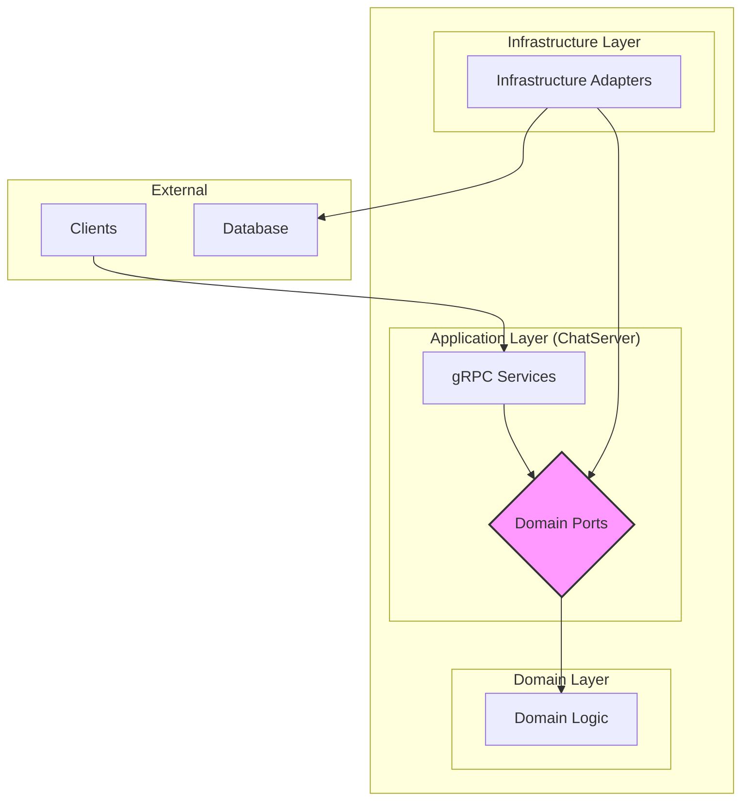

# ChatServer

This project is a gRPC-based chat server built with ASP.NET Core, following the principles of Hexagonal Architecture (also known as Ports and Adapters). This architectural style promotes a clear separation of concerns, making the application more modular, testable, and maintainable.

## Architecture

The application is divided into three main layers:

*   **Domain:** This is the core of the application, containing the business logic and entities. It has no dependencies on any other layer.
*   **Application:** This layer orchestrates the application's use cases, acting as a bridge between the outside world and the domain. In this project, the gRPC services in the `ChatServer` project serve as this layer.
*   **Infrastructure:** This layer contains the concrete implementations of the interfaces (ports) defined in the domain layer. This includes things like database repositories, authentication services, and real-time messaging.

This architecture is visualized in the diagram below:



### Project Structure

*   `ChatServer/`: The main project, containing the gRPC services and the application's entry point.
    *   `Protos/`: The gRPC service definitions (`.proto` files).
    *   `Services/`: The gRPC service implementations.
*   `Domain/`: The core of the application.
    *   `Entities/`: The domain entities.
    *   `Interfaces/`: The domain service interfaces.
    *   `Ports/`: The interfaces for the infrastructure layer (repositories, etc.).
*   `Infrastructure/`: The implementation of the domain's ports.
    *   `Repositories/`: The database repository implementations.
    *   `Auth/`: The authentication service implementations.
    *   `Realtime/`: The real-time messaging implementation.

## Running the Server

To run the server, you will need the .NET 8 SDK installed.

1.  **Clone the repository:**

    ```bash
    git clone https://github.com/your-username/ChatServer.git
    cd ChatServer
    ```

2.  **Restore dependencies:**

    ```bash
    dotnet restore
    ```

3.  **Apply database migrations:**

    The application uses Entity Framework Core for database management. To create and seed the database, run the following command:

    ```bash
    dotnet ef database update --project ChatServer/Infrastructure
    ```

4.  **Run the application:**

    ```bash
    dotnet run --project ChatServer/ChatServer
    ```

    The server will start and listen for gRPC connections on the configured port.

## Client Code Examples

Here are some examples of how to use the gRPC client in different languages. These examples assume that you have already generated the client code from the `.proto` file.

### C#

```csharp
using Grpc.Net.Client;
using Chat;

// Create a channel
using var channel = GrpcChannel.ForAddress("http://localhost:5000");

// Create clients
var authClient = new AuthService.AuthServiceClient(channel);
var chatClient = new ChatService.ChatServiceClient(channel);
var userClient = new UserService.UserServiceClient(channel);

// Register a new user
var registerResponse = await authClient.RegisterAsync(new RegisterRequest
{
    Name = "testuser",
    Password = "password",
    PublicKey = "your_public_key"
});

// Login
var loginResponse = await authClient.LoginAsync(new LoginRequest
{
    Name = "testuser",
    Password = "password"
});

// Get a list of users
var usersResponse = await userClient.GetUsersAsync(new GetUsersRequest
{
    PageSize = 10
});
```

### Python

```python
import grpc
import chat_pb2
import chat_pb2_grpc

# Create a channel
channel = grpc.insecure_channel('localhost:5000')

# Create stubs
auth_stub = chat_pb2_grpc.AuthServiceStub(channel)
chat_stub = chat_pb2_grpc.ChatServiceStub(channel)
user_stub = chat_pb2_grpc.UserServiceStub(channel)

# Register a new user
register_response = auth_stub.Register(chat_pb2.RegisterRequest(
    name='testuser',
    password='password',
    public_key='your_public_key'
))

# Login
login_response = auth_stub.Login(chat_pb2.LoginRequest(
    name='testuser',
    password='password'
))

# Get a list of users
users_response = user_stub.GetUsers(chat_pb2.GetUsersRequest(
    page_size=10
))
```

### Java

```java
import io.grpc.ManagedChannel;
import io.grpc.ManagedChannelBuilder;
import chat.Chat.*;
import chat.AuthServiceGrpc;
import chat.ChatServiceGrpc;
import chat.UserServiceGrpc;

// Create a channel
ManagedChannel channel = ManagedChannelBuilder.forAddress("localhost", 5000)
    .usePlaintext()
    .build();

// Create stubs
AuthServiceGrpc.AuthServiceBlockingStub authStub = AuthServiceGrpc.newBlockingStub(channel);
ChatServiceGrpc.ChatServiceBlockingStub chatStub = ChatServiceGrpc.newBlockingStub(channel);
UserServiceGrpc.UserServiceBlockingStub userStub = UserServiceGrpc.newBlockingStub(channel);

// Register a new user
AuthResponse registerResponse = authStub.register(RegisterRequest.newBuilder()
    .setName("testuser")
    .setPassword("password")
    .setPublicKey("your_public_key")
    .build());

// Login
AuthResponse loginResponse = authStub.login(LoginRequest.newBuilder()
    .setName("testuser")
    .setPassword("password")
    .build());

// Get a list of users
GetUsersResponse usersResponse = userStub.getUsers(GetUsersRequest.newBuilder()
    .setPageSize(10)
    .build());
```
