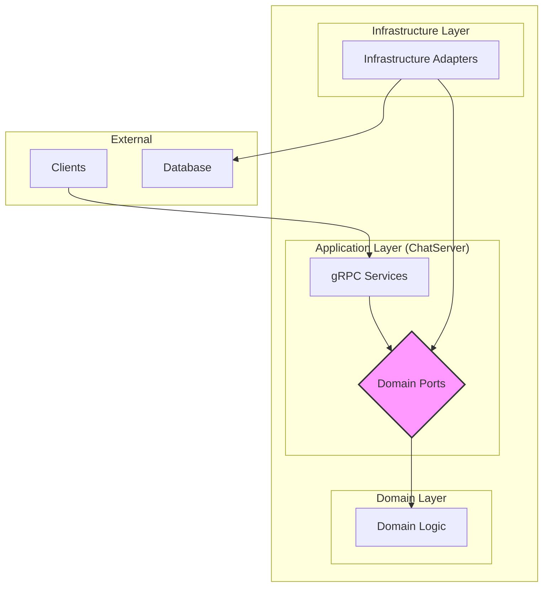

# ChatServer

This project is a gRPC-based chat server built with ASP.NET Core, following the principles of Hexagonal Architecture (also known as Ports and Adapters). This architectural style promotes a clear separation of concerns, making the application more modular, testable, and maintainable.

## Architecture

The application is divided into three main layers:

*   **Domain:** This is the core of the application, containing the business logic and entities. It has no dependencies on any other layer.
*   **Application:** This layer orchestrates the application's use cases, acting as a bridge between the outside world and the domain. In this project, the gRPC services in the `ChatServer` project serve as this layer.
*   **Infrastructure:** This layer contains the concrete implementations of the interfaces (ports) defined in the domain layer. This includes things like database repositories, authentication services, and real-time messaging.

This architecture is visualized in the diagram below:



### Project Structure

*   `ChatServer/`: The main project, containing the gRPC services and the application's entry point.
    *   `Protos/`: The gRPC service definitions (`.proto` files).
    *   `Services/`: The gRPC service implementations.
*   `Domain/`: The core of the application.
    *   `Entities/`: The domain entities.
    *   `Interfaces/`: The domain service interfaces.
    *   `Ports/`: The interfaces for the infrastructure layer (repositories, etc.).
*   `Infrastructure/`: The implementation of the domain's ports.
    *   `Repositories/`: The database repository implementations.
    *   `Auth/`: The authentication service implementations.
    *   `Realtime/`: The real-time messaging implementation.

## Running the Server

To run the server, you will need the .NET 9 SDK installed.

1.  **Clone the repository:**

    ```bash
    git clone https://github.com/konarjg/chat-server.git
    cd chat-server
    ```

2.  **Restore dependencies:**

    ```bash
    dotnet restore
    ```

3.  **Apply database migrations:**

    The application uses Entity Framework Core for database management. To create and seed the database, run the following command from the `ChatServer` directory:

    ```bash
    dotnet ef database update -p Infrastructure -s ChatServer
    ```

4.  **Run the application:**

    ```bash
    dotnet run --project ChatServer/ChatServer
    ```

    The server will start and listen for gRPC connections on the configured port.

## Client Code Examples

Here are some examples of how to use the gRPC client in different languages. These examples assume that you have already generated the client code from the `.proto` file.

**Note:** For connections on the same network, replace `localhost` with the server's IP address.

### C#

```csharp
using Grpc.Core;
using Grpc.Net.Client;
using Chat;

// --- 1. Setup ---
using var channel = GrpcChannel.ForAddress("http://localhost:5241");
var authClient = new AuthService.AuthServiceClient(channel);
var userClient = new UserService.UserServiceClient(channel);
var chatClient = new ChatService.ChatServiceClient(channel);

// --- 2. Register and Login ---
await authClient.RegisterAsync(new RegisterRequest { Name = "testuser", Password = "password", PublicKey = "key" });
var loginResponse = await authClient.LoginAsync(new LoginRequest { Name = "testuser", Password = "password" });
string accessToken = loginResponse.AccessToken;
string refreshToken = loginResponse.RefreshToken;
Console.WriteLine("Logged in successfully!");

// --- 3. Making Authenticated Calls ---
var headers = new Metadata { { "Authorization", $"Bearer {accessToken}" } };
var usersResponse = await userClient.GetUsersAsync(new GetUsersRequest { PageSize = 10 }, headers);
Console.WriteLine($"Found {usersResponse.Users.Count} users.");

// --- 4. Handling Pagination ---
if (usersResponse.Users.Count > 0)
{
    int lastId = usersResponse.Users.Last().Id;
    var nextPageRequest = new GetUsersRequest { PageSize = 10, LastId = lastId };
    var nextPageResponse = await userClient.GetUsersAsync(nextPageRequest, headers);
    Console.WriteLine($"Found {nextPageResponse.Users.Count} users on the next page.");
}

// --- 5. Refreshing the Access Token ---
var refreshResponse = await authClient.RefreshAsync(new RefreshRequest { RefreshToken = refreshToken });
accessToken = refreshResponse.AccessToken;
refreshToken = refreshResponse.RefreshToken;
Console.WriteLine("Token refreshed!");

// --- 6. Logging Out ---
await authClient.LogoutAsync(new LogoutRequest { RefreshToken = refreshToken });
Console.WriteLine("Logged out.");
```

### Python

```python
import grpc
import chat_pb2
import chat_pb2_grpc

# --- 1. Setup ---
channel = grpc.insecure_channel('localhost:5241')
auth_stub = chat_pb2_grpc.AuthServiceStub(channel)
user_stub = chat_pb2_grpc.UserServiceStub(channel)
chat_stub = chat_pb2_grpc.ChatServiceStub(channel)

# --- 2. Register and Login ---
auth_stub.Register(chat_pb2.RegisterRequest(name='testuser', password='password', public_key='key'))
login_response = auth_stub.Login(chat_pb2.LoginRequest(name='testuser', password='password'))
access_token = login_response.access_token
refresh_token = login_response.refresh_token
print("Logged in successfully!")

# --- 3. Making Authenticated Calls ---
auth_metadata = [('authorization', f'Bearer {access_token}')]
users_response = user_stub.GetUsers(chat_pb2.GetUsersRequest(page_size=10), metadata=auth_metadata)
print(f"Found {len(users_response.users)} users.")

# --- 4. Handling Pagination ---
if len(users_response.users) > 0:
    last_id = users_response.users[-1].id
    next_page_request = chat_pb2.GetUsersRequest(page_size=10, last_id=last_id)
    next_page_response = user_stub.GetUsers(next_page_request, metadata=auth_metadata)
    print(f"Found {len(next_page_response.users)} users on the next page.")

# --- 5. Refreshing the Access Token ---
refresh_response = auth_stub.Refresh(chat_pb2.RefreshRequest(refresh_token=refresh_token))
access_token = refresh_response.access_token
refresh_token = refresh_response.refresh_token
print("Token refreshed!")

# --- 6. Logging Out ---
auth_stub.Logout(chat_pb2.LogoutRequest(refresh_token=refresh_token))
print("Logged out.")
```

### Java

```java
import io.grpc.*;
import chat.Chat.*;
import chat.AuthServiceGrpc;
import chat.ChatServiceGrpc;
import chat.UserServiceGrpc;

// --- 1. Setup ---
ManagedChannel channel = ManagedChannelBuilder.forAddress("localhost", 5241).usePlaintext().build();
AuthServiceGrpc.AuthServiceBlockingStub authStub = AuthServiceGrpc.newBlockingStub(channel);
UserServiceGrpc.UserServiceBlockingStub userStub = UserServiceGrpc.newBlockingStub(channel);
ChatServiceGrpc.ChatServiceBlockingStub chatStub = ChatServiceGrpc.newBlockingStub(channel);

// --- 2. Register and Login ---
authStub.register(RegisterRequest.newBuilder().setName("testuser").setPassword("password").setPublicKey("key").build());
AuthResponse loginResponse = authStub.login(LoginRequest.newBuilder().setName("testuser").setPassword("password").build());
String accessToken = loginResponse.getAccessToken();
String refreshToken = loginResponse.getRefreshToken();
System.out.println("Logged in successfully!");

// --- 3. Making Authenticated Calls ---
ClientInterceptor authInterceptor = new ClientInterceptor() {
    @Override
    public <ReqT, RespT> ClientCall<ReqT, RespT> interceptCall(MethodDescriptor<ReqT, RespT> method, CallOptions callOptions, Channel next) {
        return new ForwardingClientCall.SimpleForwardingClientCall<ReqT, RespT>(next.newCall(method, callOptions)) {
            @Override
            public void start(Listener<RespT> responseListener, Metadata headers) {
                headers.put(Metadata.Key.of("Authorization", Metadata.ASCII_STRING_MARSHALLER), "Bearer " + accessToken);
                super.start(responseListener, headers);
            }
        };
    }
};
UserServiceGrpc.UserServiceBlockingStub authedUserStub = userStub.withInterceptors(authInterceptor);
GetUsersResponse usersResponse = authedUserStub.getUsers(GetUsersRequest.newBuilder().setPageSize(10).build());
System.out.println("Found " + usersResponse.getUsersCount() + " users.");

// --- 4. Handling Pagination ---
if (usersResponse.getUsersCount() > 0) {
    int lastId = usersResponse.getUsers(usersResponse.getUsersCount() - 1).getId();
    GetUsersRequest nextPageRequest = GetUsersRequest.newBuilder().setPageSize(10).setLastId(lastId).build();
    GetUsersResponse nextPageResponse = authedUserStub.getUsers(nextPageRequest);
    System.out.println("Found " + nextPageResponse.getUsersCount() + " users on the next page.");
}

// --- 5. Refreshing the Access Token ---
AuthResponse refreshResponse = authStub.refresh(RefreshRequest.newBuilder().setRefreshToken(refreshToken).build());
accessToken = refreshResponse.getAccessToken();
// refreshToken = refreshResponse.getRefreshToken(); // Update refresh token if server rotates it
System.out.println("Token refreshed!");

// --- 6. Logging Out ---
authStub.logout(LogoutRequest.newBuilder().setRefreshToken(refreshToken).build());
System.out.println("Logged out.");
```
