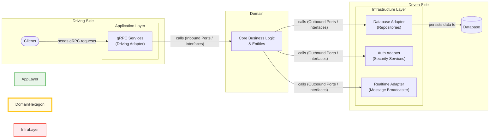

# ChatServer

This project is a gRPC-based chat server built with ASP.NET Core, following the principles of Hexagonal Architecture (also known as Ports and Adapters). This architectural style promotes a clear separation of concerns, making the application more modular, testable, and maintainable.

## Architecture

The application is designed around a central **Domain Layer**, which contains the core business logic and is completely independent of any external technologies. This core is surrounded by an **Application Layer** and an **Infrastructure Layer**.

-   **Domain Layer (The Hexagon)**: This is the heart of the application, containing the business logic, entities, and the all-important **Ports**. Ports are interfaces that define how the application's core logic is invoked (inbound ports) and how the core communicates with external systems like databases (outbound ports).

-   **Application Layer (Driving Adapters)**: This layer contains the "driving" adapters that translate external requests into calls on the domain's inbound ports. In this project, the gRPC services act as the primary driving adapter, receiving commands from clients.

-   **Infrastructure Layer (Driven Adapters)**: This layer contains the "driven" adapters that provide concrete implementations for the domain's outbound ports. This includes database repositories, authentication services, and real-time messaging clients that are "driven" by the application core.

This architecture is visualized in the diagram below:



### Project Structure

*   `ChatServer/`: The main project, containing the gRPC services and the application's entry point (Application Layer).
    *   `Protos/`: The gRPC service definitions (`.proto` files).
    *   `Services/`: The gRPC service implementations.
*   `Domain/`: The core of the application (Domain Layer).
    *   `Entities/`: The domain entities.
    *   `Interfaces/`: The inbound port definitions.
    *   `Ports/`: The outbound port definitions.
*   `Infrastructure/`: The implementation of the domain's ports (Infrastructure Layer).
    *   `Repositories/`: The database repository implementations.
    *   `Auth/`: The authentication service implementations.
    *   `Realtime/`: The real-time messaging implementation.

## Running the Server

To run the server, you will need the .NET 9 SDK installed.

1.  **Clone the repository:**

    ```bash
    git clone https://github.com/konarjg/chat-server.git
    cd chat-server
    ```

2.  **Restore dependencies:**

    ```bash
    dotnet restore
    ```

3.  **Apply database migrations:**

    The application uses Entity Framework Core for database management. To create and seed the database, run the following command from the `ChatServer` directory:

    ```bash
    dotnet ef database update -p Infrastructure -s ChatServer
    ```

4.  **Run the application:**

    ```bash
    dotnet run --project ChatServer/ChatServer
    ```

    The server will start and listen for gRPC connections on the configured port.

## Client Code Examples

Here are some examples of how to use the gRPC client in different languages. These examples assume that you have already generated the client code from the `.proto` file.

**Note:** For connections on the same network, replace `localhost` with the server's IP address.

### C#

```csharp
using Grpc.Core;
using Grpc.Net.Client;
using Chat;
using Google.Protobuf;

// --- 1. Setup ---
using var channel = GrpcChannel.ForAddress("http://localhost:5241");
var authClient = new AuthService.AuthServiceClient(channel);
var userClient = new UserService.UserServiceClient(channel);
var chatClient = new ChatService.ChatServiceClient(channel);

// --- 2. Register and Login ---
await authClient.RegisterAsync(new RegisterRequest { Name = "testuser", Password = "password", PublicKey = "key" });
await authClient.RegisterAsync(new RegisterRequest { Name = "anotheruser", Password = "password", PublicKey = "key2" });
var loginResponse = await authClient.LoginAsync(new LoginRequest { Name = "testuser", Password = "password" });
string accessToken = loginResponse.AccessToken;
string refreshToken = loginResponse.RefreshToken;
Console.WriteLine("Logged in successfully!");

// --- 3. Making Authenticated Calls & Pagination ---
var headers = new Metadata { { "Authorization", $"Bearer {accessToken}" } };
var usersResponse = await userClient.GetUsersAsync(new GetUsersRequest { PageSize = 10 }, headers);
Console.WriteLine($"Found {usersResponse.Users.Count} user(s).");
var otherUser = usersResponse.Users.FirstOrDefault(u => u.Name == "anotheruser");

// --- 4. Chat Operations ---
if (otherUser != null)
{
    // Create a chat
    var createChatRequest = new CreateChatRequest { ReceiverId = otherUser.Id, SenderEncryptedAesKey = ByteString.CopyFrom(new byte[32]), ReceiverEncryptedAesKey = ByteString.CopyFrom(new byte[32]) };
    var chat = await chatClient.CreateChatAsync(createChatRequest, headers);
    Console.WriteLine($"Created chat with ID: {chat.Id}");

    // --- 5. Real-time Chat Stream ---
    using var call = chatClient.ChatStream(headers);
    var readTask = Task.Run(async () => {
        await foreach (var message in call.ResponseStream.ReadAllAsync()) {
            Console.WriteLine($"Received message: {message.NewMessage.AesEncryptedContent.ToStringUtf8()}");
        }
    });
    await call.RequestStream.WriteAsync(new ClientToServerMessage { SendMessage = new SendMessageRequest { ChatId = chat.Id, AesEncryptedContent = ByteString.CopyFromUtf8("Hello!") } });
    await Task.Delay(1000);
    await call.RequestStream.CompleteAsync();
    await readTask;
}

// --- 6. Refreshing and Logging Out ---
var refreshResponse = await authClient.RefreshAsync(new RefreshRequest { RefreshToken = refreshToken });
Console.WriteLine("Token refreshed!");
await authClient.LogoutAsync(new LogoutRequest { RefreshToken = refreshResponse.RefreshToken });
Console.WriteLine("Logged out.");
```

### Python

```python
import grpc
import chat_pb2
import chat_pb2_grpc
import time

# --- 1. Setup ---
channel = grpc.insecure_channel('localhost:5241')
auth_stub = chat_pb2_grpc.AuthServiceStub(channel)
user_stub = chat_pb2_grpc.UserServiceStub(channel)
chat_stub = chat_pb2_grpc.ChatServiceStub(channel)

# --- 2. Register and Login ---
auth_stub.Register(chat_pb2.RegisterRequest(name='testuser', password='password', public_key='key'))
auth_stub.Register(chat_pb2.RegisterRequest(name='anotheruser', password='password', public_key='key2'))
login_response = auth_stub.Login(chat_pb2.LoginRequest(name='testuser', password='password'))
access_token = login_response.access_token
refresh_token = login_response.refresh_token
print("Logged in successfully!")

# --- 3. Making Authenticated Calls & Pagination ---
auth_metadata = [('authorization', f'Bearer {access_token}')]
users_response = user_stub.GetUsers(chat_pb2.GetUsersRequest(page_size=10), metadata=auth_metadata)
print(f"Found {len(users_response.users)} user(s).")
other_user = next((u for u in users_response.users if u.name == "anotheruser"), None)

# --- 4. Chat Operations ---
if other_user:
    create_chat_request = chat_pb2.CreateChatRequest(receiver_id=other_user.id, sender_encrypted_aes_key=b'x'*32, receiver_encrypted_aes_key=b'y'*32)
    chat = chat_stub.CreateChat(create_chat_request, metadata=auth_metadata)
    print(f"Created chat with ID: {chat.id}")

    # --- 5. Real-time Chat Stream ---
    def send_messages():
        time.sleep(1)
        yield chat_pb2.ClientToServerMessage(send_message=chat_pb2.SendMessageRequest(chat_id=chat.id, aes_encrypted_content=b"Hello!"))

    for response in chat_stub.ChatStream(send_messages(), metadata=auth_metadata):
        print(f"Received message: {response.new_message.aes_encrypted_content.decode('utf-8')}")

# --- 6. Refreshing and Logging Out ---
refresh_response = auth_stub.Refresh(chat_pb2.RefreshRequest(refresh_token=refresh_token))
auth_stub.Logout(chat_pb2.LogoutRequest(refresh_token=refresh_response.refresh_token))
print("Logged out.")
```

### Java

```java
import io.grpc.*;
import io.grpc.stub.StreamObserver;
import chat.Chat.*;
import chat.AuthServiceGrpc;
import chat.UserServiceGrpc;
import com.google.protobuf.ByteString;
import java.util.concurrent.CountDownLatch;
import java.util.concurrent.TimeUnit;

// --- 1. Setup ---
ManagedChannel channel = ManagedChannelBuilder.forAddress("localhost", 5241).usePlaintext().build();
AuthServiceGrpc.AuthServiceBlockingStub authStub = AuthServiceGrpc.newBlockingStub(channel);
UserServiceGrpc.UserServiceBlockingStub userStub = UserServiceGrpc.newBlockingStub(channel);
ChatServiceGrpc.ChatServiceBlockingStub chatStub = ChatServiceGrpc.newBlockingStub(channel);
ChatServiceGrpc.ChatServiceStub asyncChatStub = ChatServiceGrpc.newStub(channel);

// --- 2. Register and Login ---
authStub.register(RegisterRequest.newBuilder().setName("testuser").setPassword("password").setPublicKey("key").build());
authStub.register(RegisterRequest.newBuilder().setName("anotheruser").setPassword("password").setPublicKey("key2").build());
AuthResponse loginResponse = authStub.login(LoginRequest.newBuilder().setName("testuser").setPassword("password").build());
final String accessToken = loginResponse.getAccessToken();
String refreshToken = loginResponse.getRefreshToken();
System.out.println("Logged in successfully!");

// --- 3. Authenticated Stubs & Pagination ---
ClientInterceptor authInterceptor = new ClientInterceptor() {
    public <ReqT, RespT> ClientCall<ReqT, RespT> interceptCall(MethodDescriptor<ReqT, RespT> method, CallOptions o, Channel n) {
        return new ForwardingClientCall.SimpleForwardingClientCall<>(n.newCall(method, o)) {
            public void start(Listener<RespT> res, Metadata h) {
                h.put(Metadata.Key.of("Authorization", Metadata.ASCII_STRING_MARSHALLER), "Bearer " + accessToken);
                super.start(res, h);
            }
        };
    }
};
UserServiceGrpc.UserServiceBlockingStub authedUserStub = userStub.withInterceptors(authInterceptor);
ChatServiceGrpc.ChatServiceBlockingStub authedChatStub = chatStub.withInterceptors(authInterceptor);
ChatServiceGrpc.ChatServiceStub authedAsyncChatStub = asyncChatStub.withInterceptors(authInterceptor);

GetUsersResponse usersResponse = authedUserStub.getUsers(GetUsersRequest.newBuilder().setPageSize(10).build());
System.out.println("Found " + usersResponse.getUsersCount() + " user(s).");
User otherUser = usersResponse.getUsersList().stream().filter(u -> u.getName().equals("anotheruser")).findFirst().orElse(null);

// --- 4. Chat Operations & Streaming ---
if (otherUser != null) {
    CreateChatRequest createChatRequest = CreateChatRequest.newBuilder()
        .setReceiverId(otherUser.getId())
        .setSenderEncryptedAesKey(ByteString.copyFrom(new byte[32]))
        .setReceiverEncryptedAesKey(ByteString.copyFrom(new byte[32]))
        .build();
    chat.Chat newChat = authedChatStub.createChat(createChatRequest);
    System.out.println("Created chat with ID: " + newChat.getId());

    CountDownLatch latch = new CountDownLatch(1);
    StreamObserver<ClientToServerMessage> req = authedAsyncChatStub.chatStream(new StreamObserver<>() {
        public void onNext(ServerToClientMessage v) { System.out.println("Received: " + v.getNewMessage().getAesEncryptedContent().toStringUtf8()); }
        public void onError(Throwable t) { latch.countDown(); }
        public void onCompleted() { latch.countDown(); }
    });
    req.onNext(ClientToServerMessage.newBuilder().setSendMessage(SendMessageRequest.newBuilder().setChatId(newChat.getId()).setAesEncryptedContent(ByteString.copyFromUtf8("Hello!")).build()).build());
    req.onCompleted();
    latch.await(1, TimeUnit.MINUTES);
}

// --- 5. Refreshing and Logging out ---
refreshToken = authStub.refresh(RefreshRequest.newBuilder().setRefreshToken(refreshToken).build()).getRefreshToken();
authStub.logout(LogoutRequest.newBuilder().setRefreshToken(refreshToken).build());
System.out.println("Logged out.");
```
